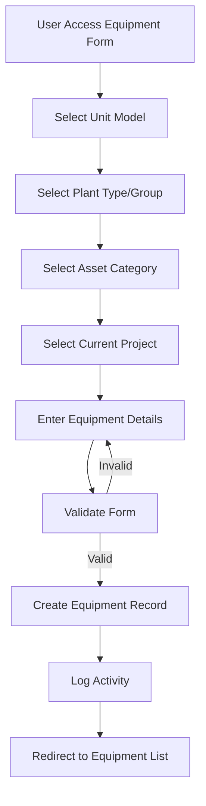
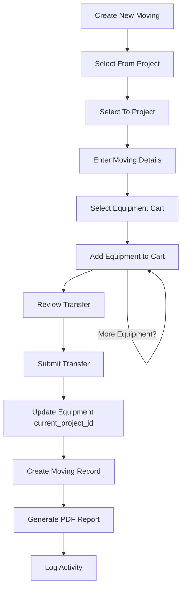
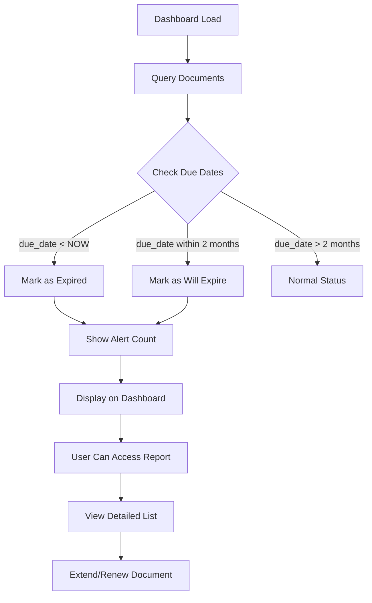
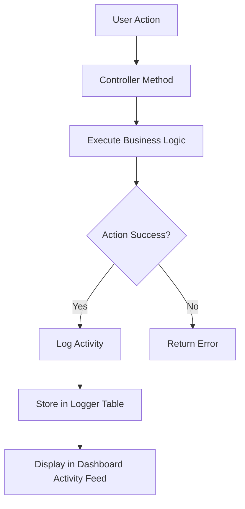

**Purpose**: Technical reference for understanding system design and development patterns
**Last Updated**: 2025-10-30

# ARKFleet - Equipment Fleet Management System

## Architecture Documentation Guidelines

### Document Purpose

This document describes the CURRENT WORKING STATE of the application architecture. It serves as:

- Technical reference for understanding how the system currently works
- Onboarding guide for new developers
- Design pattern documentation for consistent development
- Schema and data flow documentation reflecting actual implementation

---

## Project Overview

**ARKFleet v.10** is a comprehensive Equipment Fleet Management System designed for tracking and managing heavy equipment, construction machinery, and vehicles across multiple project sites. The system handles equipment tracking, document management (BPKB, STNK, insurance policies), inter-project equipment transfers (IPA - Internal Property Assignment), and various compliance reports.

### Primary Use Cases

1. **Equipment Lifecycle Management**: Track equipment from acquisition to disposal
2. **Project-based Equipment Allocation**: Assign and transfer equipment between project locations
3. **Document Compliance**: Monitor expiring documents (licenses, insurance, permits)
4. **Fleet Reporting**: Generate reports on equipment status, utilization, and movements
5. **User & Permission Management**: Role-based access control for different user types

---

## Technology Stack

### Backend
- **Framework**: Laravel 10.x (PHP 8.1+)
- **Database**: MySQL (currently connected to `genaf_db` but designed for `arkfleet_db`)
- **Authentication**: Laravel Sanctum + Session-based auth
- **Authorization**: Spatie Laravel Permission (roles & permissions)
- **Data Tables**: Yajra Laravel DataTables 9.0
- **Excel Export**: Maatwebsite Excel 3.1
- **Notifications**: RealRashid Sweet Alert

### Frontend
- **Template**: AdminLTE (jQuery-based admin template)
- **CSS Framework**: Bootstrap 4/5
- **JavaScript**: Vanilla JS + jQuery
- **DataTables**: jQuery DataTables with server-side processing
- **Icons**: Font Awesome

### Development Tools
- **Testing**: PHPUnit 10.0
- **Code Quality**: Laravel Pint
- **Local Development**: Laravel Sail (Docker-based)

---

## Core Components

### 1. Equipment Management Module

**Purpose**: Central hub for managing all equipment/fleet assets

**Key Features**:
- Equipment registration with comprehensive details (unit number, model, status, location)
- Equipment photos management
- Equipment detail tracking (serial numbers, engine model, chassis number)
- Unit number history tracking
- Active/Inactive status management
- RFU (Ready For Use) and BD (Break Down) status updates

**Core Models**: `Equipment`, `EquipmentDetail`, `EquipmentPhoto`, `UnitnoHistory`

**Controllers**: `EquipmentController`, `EquipmentPhotoController`

### 2. Moving/Transfer Module (IPA)

**Purpose**: Manage equipment transfers between project sites

**Key Features**:
- Create transfer orders from one project to another
- Cart-based equipment selection for batch transfers
- Transfer history tracking
- PDF report generation for transfer documents
- Before/after equipment condition recording

**Core Models**: `Moving`, `MovingDetail`

**Controllers**: `MovingController`, `MovingDetailController`

### 3. Document Management Module

**Purpose**: Track compliance documents with expiration monitoring

**Key Features**:
- Document type categorization (BPKB, STNK, Insurance Policy, Purchase Order)
- Expiration date tracking and alerts
- Document extension/renewal tracking
- Supplier/vendor association
- Cost tracking per document
- File attachment support

**Core Models**: `Document`, `DocumentType`

**Controllers**: `DocumentController`, `DocumentTypeController`

### 4. Project Management Module

**Purpose**: Manage project sites where equipment is deployed

**Key Features**:
- Project code and location tracking
- Client (Bowheer) information
- Active/Inactive project status
- Equipment allocation per project

**Core Models**: `Project`

**Controllers**: `ProjectController`

### 5. Reports Module

**Purpose**: Generate various operational and compliance reports

**Available Reports**:
- Equipment activation by month
- Equipment active status by projects
- Documents expiring/overdue
- Summary IPA (Inter-Project Assignment)
- Excel export capabilities

**Controllers**: `ReportController`, `ReportSummaryIpaController`, `ReportActiveStatusController`

### 6. User & Access Management

**Purpose**: Manage users with role-based permissions

**Key Features**:
- User CRUD operations
- Role management with Spatie Permission
- Permission assignment
- User activation/deactivation
- Activity logging

**Core Models**: `User`, `Role`, `Permission` (Spatie), `Logger`, `Activity`

**Controllers**: `UserController`, `RoleController`, `PermissionController`

### 7. Master Data Management

**Purpose**: Maintain reference data for equipment categorization

**Entities**:
- **Asset Categories**: Major/Minor classification
- **Plant Types**: Equipment types (Digger, Hauler, etc.)
- **Plant Groups**: Sub-categories (Lighting Tower, Welding, etc.)
- **Manufactures**: Equipment manufacturers
- **Unit Models**: Equipment models with specifications
- **Unit Status**: Equipment operational status
- **Suppliers**: Vendors and service providers
- **Departments**: Organizational units

**Controllers**: Various master data controllers (`ManufactureController`, `PlantTypeController`, etc.)

---

## Database Schema

### Core Tables

#### equipments
Primary table for fleet assets
```sql
- id (PK)
- unit_no (unique identifier)
- active_date
- description
- unitmodel_id (FK to unit_models)
- asset_category_id (FK to asset_categories)
- plant_type_id (FK to plant_types)
- plant_group_id (FK to plant_groups)
- unitstatus_id (FK to unitstatuses)
- current_project_id (FK to projects) -- current location
- serial_no
- chasis_no
- engine_model
- machine_no
- nomor_polisi (license plate)
- bahan_bakar (fuel type)
- warna (color)
- unit_pic (person in charge)
- cart_flag (used in transfer process)
- capacity
- assign_to (FK to users)
- remarks
- created_by, updated_by (FK to users)
- timestamps
```

#### movings
Equipment transfer records
```sql
- id (PK)
- moving_no (transfer number)
- moving_date
- from_project_id (FK to projects)
- to_project_id (FK to projects)
- description
- created_by, updated_by (FK to users)
- timestamps
```

#### moving_details
Individual equipment items in a transfer
```sql
- id (PK)
- moving_id (FK to movings)
- equipment_id (FK to equipments)
- timestamps
```

#### documents
Compliance documents tracking
```sql
- id (PK)
- equipment_id (FK to equipments)
- document_type_id (FK to document_types)
- document_no
- document_date
- supplier_id (FK to suppliers)
- amount (cost)
- due_date (expiration date)
- remarks
- filename (attachment)
- extended_doc_id (FK to documents - for renewals)
- user_id (created by)
- soft_deletes
- timestamps
```

#### projects
Project sites/locations
```sql
- id (PK)
- project_code
- bowheer (client name)
- location
- address
- city
- isActive (1=active, 0=inactive)
- created_by (FK to users)
- timestamps
```

#### users
System users
```sql
- id (PK)
- name
- nik (employee ID)
- username
- email
- password
- project (assigned project)
- department_id (FK to departments)
- is_active (boolean)
- timestamps
```

### Master Data Tables

- **unit_models**: Equipment models with manufacture_id
- **manufactures**: Equipment manufacturers
- **plant_types**: Equipment type categories
- **plant_groups**: Sub-categories under plant types
- **asset_categories**: Major/Minor classification
- **document_types**: Types of compliance documents
- **suppliers**: Vendors and service providers
- **unitstatuses**: Equipment operational status
- **unitno_histories**: Historical unit number changes
- **departments**: Organizational departments

### Audit & Logging

- **activities**: User activity log
- **loggers**: System event log
- **equipment_photos**: Photo attachments for equipment

### Spatie Permission Tables

- **roles**: User roles
- **permissions**: System permissions
- **model_has_roles**: User-role assignments
- **model_has_permissions**: User-permission assignments
- **role_has_permissions**: Role-permission assignments

---

## Key Relationships

```
Equipment
├── belongsTo: UnitModel → Manufacture
├── belongsTo: PlantType
├── belongsTo: PlantGroup
├── belongsTo: AssetCategory
├── belongsTo: Unitstatus
├── belongsTo: Project (current_project_id)
├── belongsTo: User (created_by, updated_by, assign_to)
├── hasMany: Document
├── hasMany: MovingDetail
├── hasMany: UnitnoHistory
└── hasMany: EquipmentPhoto

Moving
├── belongsTo: Project (from_project_id)
├── belongsTo: Project (to_project_id)
├── belongsTo: User (created_by)
└── hasMany: MovingDetail → Equipment

Document
├── belongsTo: Equipment
├── belongsTo: DocumentType
├── belongsTo: Supplier
└── belongsTo: Document (extended_doc_id - self-referencing)

Project
├── hasMany: Equipment (current_project_id)
└── hasMany: Moving (from/to projects)

PlantType
└── hasMany: PlantGroup

User
├── hasMany: Equipment (as creator, updater, assignee)
├── hasMany: Moving (as creator)
└── hasMany: Document (as creator)
```

---

## API Design

### Web Routes (Authenticated)

All routes require authentication middleware except login/register.

#### Equipment Routes
```
GET  /equipments              - List equipments (DataTables)
GET  /equipments/create       - Create form
POST /equipments              - Store new equipment
GET  /equipments/{id}         - Show equipment details
GET  /equipments/{id}/edit    - Edit form
PUT  /equipments/{id}         - Update equipment
DELETE /equipments/{id}       - Delete equipment
GET  /equipments/data         - DataTables AJAX endpoint
GET  /equipments/{id}/photos  - Manage equipment photos
POST /equipments/update_rfu   - Update RFU status
POST /equipments/update_bd    - Update breakdown status
GET  /equipments/export_excel - Export to Excel
```

#### Moving/Transfer Routes
```
GET  /movings                 - List transfers
GET  /movings/create          - Create transfer
POST /movings                 - Store transfer
GET  /movings/{id}            - Show transfer details
GET  /movings/{id}/edit       - Edit transfer
PUT  /movings/{id}            - Update transfer
GET  /movings/{id}/print_pdf  - Generate PDF report
GET  /movings/data            - DataTables AJAX endpoint

GET  /moving_details/{moving_id}/create - Add equipment to transfer
POST /moving_details          - Store equipment in transfer
PATCH /moving_details/{id}/add_tocart   - Add to cart
PATCH /moving_details/{id}/remove_fromcart - Remove from cart
```

#### Document Routes
```
GET  /documents               - List documents
POST /documents               - Store document
GET  /documents/{id}/edit     - Edit document
PUT  /documents/{id}          - Update document
DELETE /documents/{id}        - Delete document
GET  /documents/data          - DataTables AJAX endpoint
GET  /documents/{id}/extends  - Extend/renew document
PUT  /documents/{id}/extends  - Update extension
```

#### Report Routes
```
GET  /reports                 - Reports index
GET  /reports/document_with_overdue - Documents expiring report
GET  /reports/summary_ipa     - IPA summary report
POST /reports/summary_ipa/export - Export IPA summary
GET  /reports/active_status   - Active equipment status
GET  /reports/active_status/export - Export active status
```

#### User Management Routes
```
GET  /users                   - List users
GET  /users/data              - DataTables AJAX endpoint
PUT  /users/activate/{id}     - Activate user
PUT  /users/deactivate/{id}   - Deactivate user
PUT  /users/roles-update/{id} - Update user roles

GET  /roles                   - List roles
GET  /permissions             - List permissions
```

### API Routes

```
GET /api/equipments           - Equipment list (JSON)
GET /api/projects             - Projects list (JSON)
```

---

## Data Flow

### Equipment Registration Flow



### Equipment Transfer Flow (IPA)



### Document Expiration Monitoring



### User Activity Logging



---

## Security Implementation

### Authentication
- **Session-based authentication** using Laravel's built-in auth system
- **Password hashing** using bcrypt
- **Remember me** token support
- **CSRF protection** on all POST/PUT/DELETE requests

### Authorization
- **Spatie Laravel Permission** package for role-based access control
- **Middleware protection** on all authenticated routes
- **User activation/deactivation** to control access
- **Audit trail** via `created_by` and `updated_by` fields

### Data Protection
- **Soft deletes** on documents for data recovery
- **Foreign key constraints** for data integrity
- **Input validation** on all form submissions
- **XSS protection** via Blade template escaping

### Audit Trail
- **Model boot events** automatically track creator and updater
```php
static::creating(function ($model) {
    $model->created_by = auth()->user()->id;
    $model->updated_by = auth()->user()->id;
});

static::updating(function ($model) {
    $model->updated_by = auth()->user()->id;
});
```
- **Logger table** for system-wide activity tracking
- **Activity table** for user action logging

---

## Deployment

### Environment Requirements
- PHP 8.1 or higher
- MySQL 5.7 or higher
- Composer 2.x
- Node.js & NPM (for asset compilation)
- Web server (Apache/Nginx)

### Current Deployment State
- **Application**: ARKFleet v.10
- **Database**: Connected to `genaf_db` (⚠️ **Mismatch Issue**)
- **Expected Database**: `arkfleet_db` based on migrations
- **Web Server**: Running on `http://localhost:8000`

### Configuration Files
- `.env` - Environment configuration
- `config/app.php` - Application settings
- `config/database.php` - Database connections
- `config/permission.php` - Spatie permission settings
- `config/datatables.php` - DataTables configuration
- `config/excel.php` - Excel export settings

---

## Frontend Architecture

### Template Structure
```
resources/views/
├── templates/
│   ├── main.blade.php          # Master layout
│   └── partials/
│       ├── head.blade.php      # Meta tags, CSS
│       ├── navbar.blade.php    # Top navigation
│       ├── sidebar.blade.php   # Side menu
│       ├── footer.blade.php    # Footer
│       ├── script.blade.php    # JavaScript includes
│       ├── breadcrumb.blade.php
│       └── menu/               # Menu components
├── dashboard/
├── equipments/
├── movings/
├── documents/
├── reports/
├── users/
├── roles/
├── permissions/
└── [master data views]/
```

### AdminLTE Integration
- **Theme**: AdminLTE 3.x
- **Layout**: Sidebar-mini layout with fixed navbar
- **Components**: Cards, DataTables, Modals, Forms
- **Icons**: Font Awesome 5
- **Alerts**: SweetAlert integration

### JavaScript Architecture
- **jQuery** for DOM manipulation
- **DataTables** for server-side table rendering
- **Select2** for enhanced dropdowns (likely)
- **Chart.js** for dashboard visualizations
- **Custom JS** in view files for page-specific logic
- **Dark Mode Script** (`public/js/darkmode.js`) for theme management

### Dashboard Features (Enhanced 2025-10-30)

#### Visual Enhancements
- **Dark Mode Toggle**: Application-wide theme switching with localStorage persistence
- **Animated Count-Up**: Numbers animate from 0 to target value on page load (2-second duration)
- **Mini Sparkline Charts**: 7-day trend visualizations embedded in stat cards using Chart.js
- **Color-Coded Stat Cards**: 4 gradient cards (purple, green, orange, teal) for key metrics
- **Interactive Pie Chart**: Click chart segments to filter equipment status table

#### Data Visualizations
- **Fleet Overview Cards**: Total Fleet, Active Projects, Expiring Documents, Ready For Use
- **Quick Stats Summary**: Fleet Utilization % and Average Age in months
- **Equipment Health Score**: 85% gauge with color-coded readiness metrics
- **Fleet Readiness Metrics**: RFU, Under Maintenance, Inactive/Scrap counts with progress bar
- **Trend Indicators**: Week-over-week percentage changes with directional arrows

#### Interactive Elements
- **Activity Feed**: 
  - Colored icons by activity type (truck, edit, exchange, plus, sync, trash)
  - Date grouping (Today, Yesterday, This Week, Older)
  - Clickable equipment numbers and IPA numbers linking to detail pages
  - Activity type filter dropdown for client-side filtering
- **Document Status**: Color-coded badges (orange for expiring, red for expired) with action buttons
- **RFU Status Table**: Sticky first column, fullscreen mode, horizontal scroll wrapper

#### Theme System
- **Light Mode**: Default AdminLTE theme with light content area
- **Dark Mode**: Dark content with consistent dark sidebar/navbar
- **Sidebar/Navbar**: Always dark regardless of content theme
- **Table Styling**: Striped table styling disabled for cleaner appearance in both modes

---

## File Storage

### Public Assets
```
public/
├── adminlte/           # AdminLTE theme assets
│   ├── dist/           # CSS, JS, images
│   └── plugins/        # jQuery plugins
├── assets_ipa/         # IPA-specific assets
└── vendor/             # Vendor assets
```

### Storage Directories
```
storage/
├── app/
│   └── public/         # User uploads (equipment photos, documents)
├── framework/
│   ├── cache/
│   ├── sessions/
│   └── views/          # Compiled Blade templates
└── logs/
    └── laravel.log     # Application logs
```

---

## Export Capabilities

### Excel Exports
Using **Maatwebsite Excel 3.1**:
- `EquipmentsExport` - Export equipment list
- `SummaryIpaExport` - Export IPA summary
- `UnitStatusExport` - Export unit status reports

### PDF Exports
- Moving/Transfer documents
- Equipment reports
- Custom report generation capabilities

---

## Important Notes

### 🔴 Critical Issue: Database Mismatch

**Current State**: The application codebase expects database `arkfleet_db` but is currently connected to `genaf_db` (a different system with completely different schema).

**Impact**:
- Application will not function properly
- Migrations need to be run on correct database
- Data queries will fail

**Action Required**: 
- Update `.env` file to point to correct database
- Run migrations on `arkfleet_db`
- Seed initial data

See `MEMORY.md` for detailed information on this issue.

---

## Integration Points

### External Services
- None currently implemented
- Potential integration points:
  - Notification service (email/SMS for document expiry)
  - GPS tracking integration
  - Mobile app API
  - Third-party document storage

### Internal APIs
- DataTables AJAX endpoints for all list pages
- Equipment selection API for transfer module
- Dynamic dropdown APIs (plant groups by plant type)

---

## Performance Considerations

### Database Optimization
- **Indexes**: Primary keys and foreign keys indexed
- **Eager Loading**: Relationships loaded with `with()` to avoid N+1 queries
- **Server-side Processing**: DataTables use server-side processing for large datasets

### Caching Strategy
- **Config caching**: `php artisan config:cache`
- **Route caching**: `php artisan route:cache`
- **View caching**: Blade templates compiled to PHP
- **Permission caching**: Spatie permission cache

### Query Optimization
- **Select specific columns** instead of `SELECT *`
- **withDefault()** for BelongsTo relationships to avoid null checks
- **Pagination** for list views

---

## Development Patterns

### Controller Pattern
- Resource controllers for CRUD operations
- Separate methods for DataTables AJAX responses
- Activity logging after successful operations
- Consistent validation using form requests or inline validation

### Model Pattern
- **Mass assignment protection**: Using `$guarded = []`
- **Relationship definitions**: Clear relationship methods
- **Model events**: Boot method for automatic user tracking
- **Default values**: `withDefault()` for relationships

### View Pattern
- **Blade templates**: Component-based structure
- **Section yields**: Content, title_page, breadcrumb_title
- **Partials**: Reusable menu and UI components
- **AdminLTE cards**: Consistent card-based layout

---

## Testing Strategy

### Available Tests
- `tests/Feature/ExampleTest.php`
- `tests/Unit/ExampleTest.php`

**Note**: Test coverage appears minimal. Recommend expanding test suite.

---

## Maintenance & Support

### Logging
- **Laravel Log**: `storage/logs/laravel.log`
- **Activity Log**: `loggers` table for system events
- **User Activity**: `activities` table for user actions

### Monitoring
- Dashboard shows key metrics
- Document expiration alerts
- Equipment status overview
- Recent activity feed

### Backup Strategy
- **Database**: Regular MySQL backups required (not automated in code)
- **File Storage**: Backup `storage/app/public` for user uploads
- **Code**: Git version control

---

## Version Information

- **Application Version**: v.10
- **Laravel Version**: 10.x
- **PHP Version**: 8.1+
- **Last Architecture Update**: 2025-10-30
